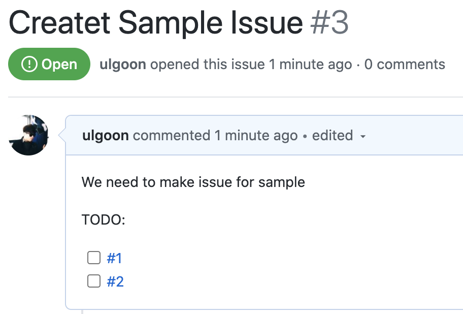
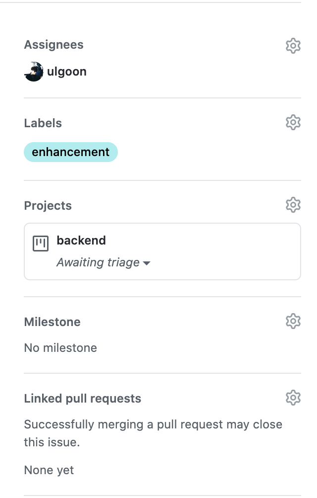
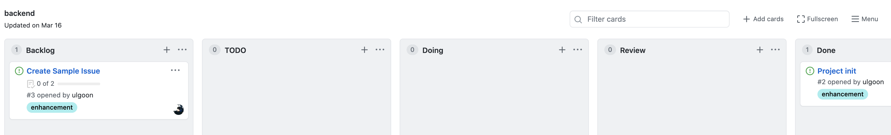
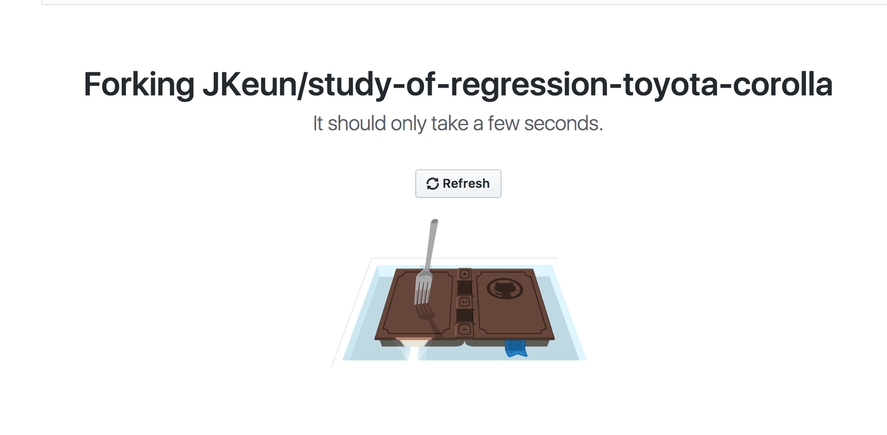
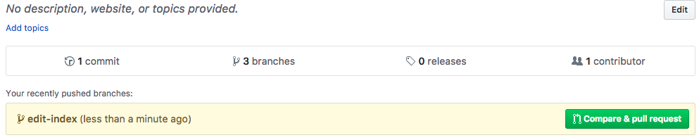
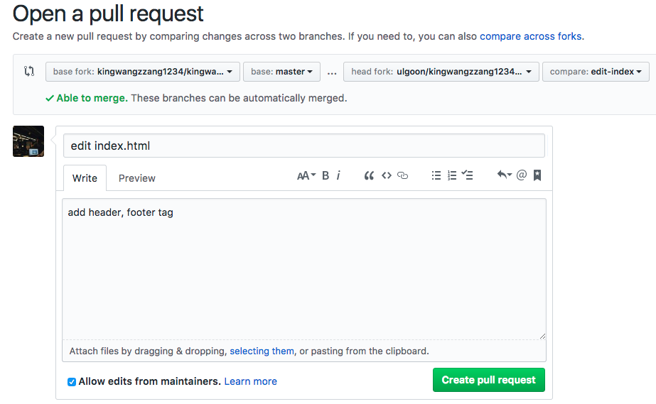
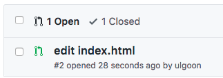
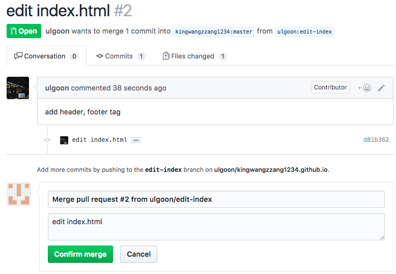
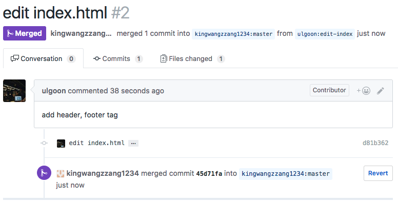

# git, github

## SSAC

### Python을 활용한 비즈니스 빅데이터 분석가 양성과정

---

<!--
paginate: true
theme: default
size: 16:9
footer : Python을 활용한 비즈니스 빅데이터 분석가 양성과정,  Wooyoung Choi, 2021
-->

## Previously..

- git의 원활한 사용을 위한 CLI shell, vim command
- 개발문서 작성을 위한 Markdown 작성법
- 원활한 git 사용 및 개발을 위한 환경 구성
- git의 구성요소와 process 실습
- commit convention 습관화
- repository 필수 요소의 작성
- Branch 사용법
- Code review

---

## Today, We will learn about..

- github pages를 이용한 github blog 만들기
- Branch 전략: git flow
- 상황별 되돌리기
- github issue와 projects 사용하기
- 협업 하는 법: Forking Workflow

---

## My First Github Pages

github 저장소를 활용해 정적인 사이트 호스팅이 가능

`username`.github.io
http://tech.kakao.com/
https://spoqa.github.io/

---

### sample index page

After create new repo throuch github,

`$ git clone https://github.com/username/username.github.io.git`

Create New file `index.html`

`$ git add .`
`$ git commit -m "first page"`
`$ git push origin master`

---

### sample index page

```html
<!doctype html>
<html>
 <head>
  <meta charset="utf-8">
  <title>My first gh page</title>
 </head>
 <body>
  <h1>Home</h1>
  <p>Hello, there!</p>
 </body>
</html>
```

---

### Static Site Generator

- [Jekyll](https://jekyllrb.com/): Ruby 기반 정적인 블로그 생성기
	- 설치와 사용이 쉬움
	- 사용자가 많았음 
- [Hugo](https://gohugo.io/): Golang 기반 정적인 블로그 생성기
	- 빠른 속도로 사이트를 생성
	- 사용자 증가 중
- [Hexo](https://hexo.io/): Node.js 기반 정적인 블로그 생성기
	- Node.js를 안다면 커스터마이즈가 쉬움
	- 빠른 속도로 사용자 증가 중

**Recommand**
`Hexo` > `Jekyll` > `Hugo`

---

## Let's use Hexo

[](https://asciinema.org/a/233626)

---

### Requirements

1. git
2. node.js(https://nodejs.org/en/)

`$ npm install -g hexo-cli`

---

## Init hexo project

```shell
$ hexo init <folder>
$ cd <folder>
$ npm install
```

## clean && generate static files

`$ hexo clean && hexo generate`

## Run hexo server

`$ hexo server`

---

## deploy

`$ npm install hexo-deployer-git --save`

```yaml
deploy:
  type: git
  repo: <repository url>  branch: [branch] #published
  message:
```

---

## branching models

- git flow
  - (hotfix)- `master` -(release)- `develop` - feature
  - pros: 가장 많이 적용, 각 단계가 명확히 구분
  - cons: 복잡..
- github flow
  - `master` - feature
  - pros: 브랜치 모델 단순화, `master`의 모든 커밋은 deployable
  - cons: CI 의존성 높음. 누구 하나라도 실수했다간..(pull request로 방지)
- gitlab flow
  - `production` - `pre-production` - `master` - feature
  - pros: deploy, issue에 대한 대응이 가능하도록 보완
  - cons: git flow와 반대 (`master`-develop, `production`-master)

---

## git flow strategy


---

## use git flow easily!

[Link](https:danielkummer.github.io/git-flow-cheatsheet/index.ko_KR.html)


---

## Practice(2)

- git flow 전략을 활용하여 어제 작성한 introduce.md를 index.html에 재작성하세요.

### Requirements

- develop 브랜치에서 다음 릴리즈를 위한 개발이 끝나야 합니다.
- head, body 등 section별 작업은 각각의 브랜치에서 작업되어야 합니다.
- css, js 작업 또한 각 브랜치를 소유합니다.(선택)
- [Semantic Web Elements](https:developer.mozilla.org/en-US/docs/Glossary/Semantics#Semantic_elements)를 적극 활용하세요.

---

## Revert Everything!

---

### Rename

- Worst
`$ mv server.py main.py` -> deleted, new file

- Best
`$ git mv server.py main.py` -> renamed

> 파일의 history를 남기기 위해서는 삭제 후 생성이 아닌 이름바꾸기로 추적

### [Undoing](https:asciinema.org/a/Fu27tl0y6RpHBPnTBHpPHh8St)

`$ git checkout -- .` or `$ git checkout -- {filename}`

---

### [Unstaging](https:asciinema.org/a/Y55mgQP0Yn8r6EEyBRSk0ysxX)

`$ git reset HEAD {filename}`

### Unstaging and Remove

`$ git rm -f {filename}`

---

### [Edit latest commit](https:asciinema.org/a/PplVwNAZND1lApmRLRo2q3jem)

`$ git commit --amend`

### [Edit prior commit](https:asciinema.org/a/03Kp8DnWV2mpBghfZ8MWAwN0q)

`$ git rebase -i <commit>`

#### [abort rebase](https:asciinema.org/a/ifWYyxutPfg04bTMrFA75KVms)

`$ git rebase --abort`

#### Complete rebase

`$ git rebase --continue`

---

### Reset Commit

#### Worst case: [Reset](https:asciinema.org/a/NvrtG3Nmf8cqa4gWlssjGmVEc)

ex) 직전 3개의 commit을 삭제한 후, remote에 강제 push

```shell
$ git reset --hard HEAD~3
$ git push -f origin <branch>
```

- 협업 시 다른 cloned repo에 존재하던 commit log로 인해 파일이 살아나거나, 과거 이력이 깔끔히 사라져 commit log tracking이 힘들어짐.
- solution: 잘못한 이력도 commit으로 박제하고 수정한 이력을 남기자!

---

#### Best case: [Revert](https:asciinema.org/a/bWGpPQM7rGMUlGrPSRc3OxjqS)

ex) 현재 HEAD에서 직전의 3개의 commit을 순서대로 거슬러 올라가 해당 내역에 대해 commit, push 수행

```shell
$ git revert --no-commit HEAD~3

$ git commit

$ git push origin <branch>
```

- 잘못하기 전 과거로 돌아가 최신을 유지하면서 되돌렸다는 이력을 commit으로 남겨 모든 팀원이 이 사항을 공유하고 주지시킬 수 있음.

---

## github issue and projects

---

## Issue & Projects

Issue: 프로젝트, 레포와 관계된 모든 해야할 일과 버그, 개선사항 등을 기록

Projects: 해야할 일의 진도에 따른 구성과 우선순위 지정

---

### Issue(1)


---

### Issue(2)



---

### Issue(3-1)



---

### Issue(3-2)

- Assignees: 이 이슈에 대한 책임인원
- Labels: 이슈의 종류
- Projects: 이슈를 배당할 프로젝트
- Milestone: 이슈에 해당하는 중요 시점 지정

---

### Projects

---

### Projects(2)



---

## Collaborate with your teammates

---

### Forking workflow

---

## Collaboration

Add, Commit and Push like you own it. 

---

## Method 2: Fork and Merge


---

## Fork and Merge



---

## Fork and Merge


---

## Fork and Merge

`$ git clone https://github.com/username/forked-repo.git`

---

## Fork and Merge

`$ git branch -a`
`$ git checkout -b new-feature`

---

## Fork and Merge

Make some change

`$ git add file`
`$ git commit -m "commit message"`
`$ git push origin new-feature`

---

## Fork and Merge



---

## Fork and Merge



---

## Fork and Merge


---

## Fork and Merge



---

## Fork and Merge


---

## Fork and Merge



---

## Fork and Merge




---

### dev2,dev3,devn, .. : Update develop branch

#### In case of having upstream

```shell
$ git fetch upstream develop
$ git merge FETCH_HEAD
```

```shell
$ git remote add pmorigin {PM repo addr}
$ git fetch pmorigin develop
$ git merge FETCH_HEAD
```

---

## Practice(3)

- 수업 중 제공되는 저의 repository 주소에 접근하여 fork 한 뒤, 하고 싶은 말을 Chat.md 에 pull request 하세요.

---

## Practice(4)

- 3~4인이 팀이 되어 프로젝트 수행
- 아래의 과제 중 하나 이상을 수행할 것
  1. [피보나치킨](https:fibonachicken.herokuapp.com/) 클론(치킨과 인원 수에 따라 적절한 맥주의 용량도 출력)
  2. Bulls and Cows
  3. Monty Hall Problem Simulator
- Requirements
  - 타겟 플랫폼, 언어나 Framework는 팀 내 협의 후 결정
  - 서비스 기획 -> backlog 작성(issue, projects) -> 개발 -> 평가 순으로 진행

---

## Wrap it up!

- branch를 활용한 개발은 코드의 독립성을 보장한다.
- branching strategy 중 git flow 전략을 잘 활용하면 깔끔한 코드관리와 CI/CD에서도 도움이 될 수 있다.
- 모든 잘못된 작업은 push 하기 전까지 아무도 모르게 되돌릴 수 있다.
- issue와 projects를 활용하면, 현재 프로젝트의 진행상황을 깔끔하게 관리할 수 있다.
- git flow 전략과 forking workflow를 활용하면 비동기적 분산형 저장소의 장점을 잘 살릴 수 있다.

<link href="https://fonts.googleapis.com/css?family=Nanum+Gothic:400,800" rel="stylesheet">
<link rel='stylesheet' href='//cdn.jsdelivr.net/npm/hack-font@3.3.0/build/web/hack-subset.css'>

<style>
h1,h2,h3,h4,h5,h6,
p,li, dd, table > * > * {
font-family: 'Nanum Gothic', Gothic;
}
span, pre {
font-family: 'Hack', monospace;
}
</style>